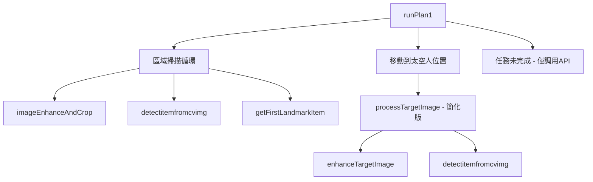
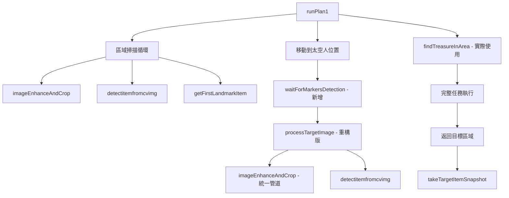

# YoloPatrol4Spot vs YoloPatrol4Spot_AndGetTarget

## 概述
本文檔詳細說明了從 `yolo_patrol4spot.java` 升級到 `yolo_patrol4spot_andgettarget.java` 的所有改動，包括新增方法、重構方法和改進的任務流程。

---

## 1. 新增方法詳解

### 1.1 waitForMarkersDetection() - 全新新增方法

#### 方法簽名
```java
private boolean waitForMarkersDetection(int maxWaitTimeMs, int intervalMs, String debugPrefix)
```

#### 完整實現
```java
    /**
     * Verifies that ArUco markers are visible by taking pictures at regular intervals
     * @param maxWaitTimeMs Maximum time to wait (e.g., 2000)
     * @param intervalMs Interval between attempts (e.g., 200)
     * @param debugPrefix Prefix for saved debug images (e.g., "astronaut")
     * @return true if markers detected, false if timeout
     */
    private boolean waitForMarkersDetection(int maxWaitTimeMs, int intervalMs, String debugPrefix) {
        boolean markersDetected = false;
        int maxAttempts = maxWaitTimeMs / intervalMs;
        int attempts = 0;
        long startTime = System.currentTimeMillis();

        Log.i(TAG, String.format("Starting marker detection verification - max %dms, interval %dms",
                maxWaitTimeMs, intervalMs));

        while (!markersDetected && attempts < maxAttempts) {
            try {
                // Take a picture
                Mat testImage = api.getMatNavCam();

                if (testImage != null) {
                    // Initialize ArUco detection
                    Dictionary dictionary = Aruco.getPredefinedDictionary(Aruco.DICT_5X5_250);
                    List<Mat> corners = new ArrayList<>();
                    Mat ids = new Mat();

                    // Detect markers
                    Aruco.detectMarkers(testImage, dictionary, corners, ids);

                    if (corners.size() > 0) {
                        markersDetected = true;
                        long elapsedTime = System.currentTimeMillis() - startTime;
                        Log.i(TAG, String.format("SUCCESS: %d markers detected after %d attempts (%.1fs)",
                                corners.size(), attempts + 1, elapsedTime / 1000.0));

                        // Save successful image for debugging
                        api.saveMatImage(testImage, debugPrefix + "_markers_detected.png");
                    } else {
                        Log.d(TAG, String.format("Attempt %d/%d: No markers detected", attempts + 1, maxAttempts));
                    }

                    // Clean up ArUco detection resources
                    for (Mat corner : corners) {
                        corner.release();
                    }
                    ids.release();

                    // Clean up test image
                    testImage.release();
                } else {
                    Log.w(TAG, "Failed to get image from camera on attempt " + (attempts + 1));
                }

                attempts++;

                // Wait before next attempt (only if not the last attempt)
                if (!markersDetected && attempts < maxAttempts) {
                    Thread.sleep(intervalMs);
                }

            } catch (InterruptedException e) {
                Log.w(TAG, "Sleep interrupted during marker detection");
                break;
            } catch (Exception e) {
                Log.e(TAG, "Error during marker detection attempt " + (attempts + 1) + ": " + e.getMessage());
                attempts++;

                // Still wait before next attempt
                if (attempts < maxAttempts) {
                    try {
                        Thread.sleep(intervalMs);
                    } catch (InterruptedException ie) {
                        Log.w(TAG, "Sleep interrupted after error");
                        break;
                    }
                }
            }
        }

        // Log final result
        long totalTime = System.currentTimeMillis() - startTime;
        if (markersDetected) {
            Log.i(TAG, String.format("%s position verified - markers visible", debugPrefix));
            return true;
        } else {
            Log.w(TAG, String.format("WARNING: No markers detected at %s after %d attempts (%.1fs)",
                    debugPrefix, attempts, totalTime / 1000.0));
            return false;
        }
    }

```

#### 核心功能
1. **循環檢測機制**：在指定時間內重複檢測ArUco標記
2. **智能超時控制**：避免無限等待，提供可配置的超時設定
3. **詳細日志記錄**：記錄每次嘗試和最終結果
4. **自動調試保存**：成功檢測時自動保存圖像
5. **資源管理**：確保每次循環後正確釋放圖像資源

#### 調用場景
```java
// 在太空人互動前驗證標記可見性
boolean astronautMarkersOk = waitForMarkersDetection(2000, 200, "astronaut");
```

---

## 2. 重構方法對比

### 2.1 processTargetImage() - 完全重構

#### 原始版本（簡化處理）
```java
private String processTargetImage(Mat targetImage, Size resizeSize) {
    try {
        Log.i(TAG, "Processing target image from astronaut");
        
        // 保存原始目標圖像
        api.saveMatImage(targetImage, "target_astronaut_raw.png");
        
        // 應用基本增強
        Mat enhancedTarget = enhanceTargetImage(targetImage, resizeSize);
        
        if (enhancedTarget != null) {
            // 使用簡化的YOLO檢測
            Object[] detected_items = detectitemfromcvimg(
                enhancedTarget, 
                0.3f,      // 較低的信心度
                "target",  // 目標類型
                0.45f, 0.8f, 320
            );
            
            Set<String> treasureTypes = (Set<String>) detected_items[1];
            // ... 處理結果
        }
        
        return "unknown";
    } catch (Exception e) {
        return "unknown";
    }
}
```

#### 更新版本（統一處理管道）
```java
private String processTargetImage(Mat targetImage, Size resizeSize) {
    try {
        Log.i(TAG, "Processing target image from astronaut");

        // 保存原始目標圖像
        api.saveMatImage(targetImage, "target_astronaut_raw.png");

        // 使用與區域處理相同的完整管道（ArUco檢測 + 裁切 + 增強）
        Size cropWarpSize = new Size(640, 480);   // 與區域處理相同
        Mat processedTarget = imageEnhanceAndCrop(targetImage, cropWarpSize, resizeSize, 0); // 使用0作為目標標識

        if (processedTarget != null) {
            Log.i(TAG, "Target image processing successful - markers detected and cropped");

            // 使用與區域處理相同的YOLO檢測邏輯
            Object[] detected_items = detectitemfromcvimg(
                    processedTarget,
                    0.3f,      // 較低的信心度用於目標檢測
                    "target",  // img_type for target
                    0.45f,     // standard_nms_threshold
                    0.8f,      // overlap_nms_threshold
                    320        // img_size
            );

            // 提取結果 - 與區域處理相同的邏輯
            Map<String, Integer> landmark_items = (Map<String, Integer>) detected_items[0];
            Set<String> treasure_types = (Set<String>) detected_items[1];

            Log.i(TAG, "Target - Landmark quantities: " + landmark_items);
            Log.i(TAG, "Target - Treasure types: " + treasure_types);

            if (!treasure_types.isEmpty()) {
                String targetTreasure = treasure_types.iterator().next();
                Log.i(TAG, "Target treasure detected: " + targetTreasure);
                processedTarget.release();
                return targetTreasure;
            }

            processedTarget.release();
        } else {
            Log.w(TAG, "Target image processing failed - no markers detected or processing error");
        }

        return "unknown";
    } catch (Exception e) {
        Log.e(TAG, "Error processing target image: " + e.getMessage());
        return "unknown";
    }
}
```

#### 關鍵改進對比

| 特性 | 原始版本 | 更新版本 |
|------|----------|----------|
| **圖像預處理** | 簡單的resize + CLAHE | 完整的ArUco檢測 + 透視裁切 + CLAHE + 二值化 |
| **處理管道** | 獨立的簡化流程 | 與區域檢測統一的處理管道 |
| **標記檢測** | 無ArUco檢測 | 包含ArUco標記檢測和定位 |
| **圖像品質** | 基本增強 | 專業級圖像處理（透視校正、對比度增強、二值化） |
| **一致性** | 與區域檢測不一致 | 與區域檢測完全一致 |
| **調試支持** | 基本圖像保存 | 完整的處理步驟圖像保存 |

---

### 2.2 enhanceTargetImage() - 保留但不再使用

#### 方法實現（兩版本相同）
```java
/**
 * 目標圖像的基本增強（比區域處理簡單）
 */
private Mat enhanceTargetImage(Mat image, Size resizeSize) {
    try {
        // 調整到處理尺寸
        Mat resized = new Mat();
        Imgproc.resize(image, resized, resizeSize);
        
        // 應用基本CLAHE增強
        Mat enhanced = new Mat();
        CLAHE clahe = Imgproc.createCLAHE();
        clahe.setClipLimit(2.0);
        clahe.setTilesGridSize(new Size(8, 8));
        clahe.apply(resized, enhanced);
        
        // 保存增強的目標圖像用於調試
        api.saveMatImage(enhanced, "target_astronaut_enhanced.png");
        
        resized.release();
        return enhanced;
        
    } catch (Exception e) {
        Log.e(TAG, "Error enhancing target image: " + e.getMessage());
        return null;
    }
}
```

**狀態變化**：
- **原始版本**：被 `processTargetImage()` 調用
- **更新版本**：保留但不再使用，被 `imageEnhanceAndCrop()` 取代

---

### 2.3 findTreasureInArea() - 無變化但關鍵性增強

#### 方法實現（兩版本完全相同）
```java
/**
 * 尋找包含指定寶藏類型的區域
 * @param treasureType 要尋找的寶藏類型
 * @param areaTreasure 區域寶藏映射
 * @return 區域ID（1-4）或0（未找到）
 */
private int findTreasureInArea(String treasureType, Map<Integer, Set<String>> areaTreasure) {
    for (int areaId = 1; areaId <= 4; areaId++) {
        Set<String> treasures = areaTreasure.get(areaId);
        if (treasures != null && treasures.contains(treasureType)) {
            return areaId;
        }
    }
    return 0; // 未找到
}
```

#### 使用場景變化

| 版本 | 使用狀態 | 調用位置 |
|------|----------|----------|
| **原始版本** | 定義但未調用 | 僅定義，無實際使用 |
| **更新版本** | 核心邏輯組件 | 在 `runPlan1()` 中的任務執行階段調用 |

```java
// 更新版本中的實際調用
int targetAreaId = findTreasureInArea(targetTreasureType, areaTreasure);
if (targetAreaId > 0) {
    Log.i(TAG, "Target treasure '" + targetTreasureType + "' found in Area " + targetAreaId);
    // 執行返回目標區域的邏輯
}
```

---

## 3. 方法調用流程對比

### 3.1 原始版本流程


### 3.2 更新版本流程


---

## 4. 實例變數和座標更新

### 4.1 新增實例變數
```java
// 新增：追蹤所有發現的地標類型
private Set<String> foundLandmarks = new HashSet<>();
```

### 4.2 座標精度提升
```java
// 原始版本
private final Point[] AREA_POINTS = {
    new Point(10.9d, -10.0000d, 5.195d),    // Area 1
    new Point(10.925d, -8.875d, 4.602d),    // Area 2
    new Point(10.925d, -7.925d, 4.60093d),  // Area 3
    new Point(10.766d, -6.852d, 4.945d)     // Area 4
};

// 更新版本 - 精度提升
private final Point[] AREA_POINTS = {
    new Point(10.95d, -9.78d, 5.195d),         // Area 1 - X、Y座標調整
    new Point(10.925d, -8.875d, 4.56203d),     // Area 2 - Z座標精度提升
    new Point(10.925d, -7.925d, 4.56093d),     // Area 3 - Z座標微調
    new Point(10.666984d, -6.8525d, 4.945d)    // Area 4 - X、Y座標精度提升
};
```

---

## 5. 任務執行邏輯完整實現

### 5.1 太空人互動增強
```java
// 新增：標記驗證機制
boolean astronautMarkersOk = waitForMarkersDetection(2000, 200, "astronaut");

if (astronautMarkersOk) {
    Log.i(TAG, "Astronaut markers confirmed - proceeding with target detection");
} else {
    Log.w(TAG, "Astronaut markers not detected - proceeding anyway");
}
```

### 5.2 完整的目標處理和任務執行
```java
if (targetTreasureType != null && !targetTreasureType.equals("unknown")) {
    // 尋找目標區域
    int targetAreaId = findTreasureInArea(targetTreasureType, areaTreasure);
    
    if (targetAreaId > 0) {
        // 執行完整的任務流程
        api.notifyRecognitionItem();
        
        // 返回目標區域
        Point targetAreaPoint = AREA_POINTS[targetAreaId - 1];
        Quaternion targetAreaQuaternion = AREA_QUATERNIONS[targetAreaId - 1];
        api.moveTo(targetAreaPoint, targetAreaQuaternion, false);
        
        // 完成任務
        api.takeTargetItemSnapshot();
        Log.i(TAG, "Mission completed successfully!");
    }
}
```

---

## 6. 錯誤處理和調試改進

### 6.1 多層級錯誤處理
```java
// 目標識別失敗處理
if (targetAreaId > 0) {
    // 正常流程
} else {
    Log.w(TAG, "Target treasure '" + targetTreasureType + "' not found in any area");
    api.notifyRecognitionItem();
    api.takeTargetItemSnapshot();
}

// 無法識別目標處理
} else {
    Log.w(TAG, "Could not identify target treasure from astronaut");
    api.notifyRecognitionItem();
    api.takeTargetItemSnapshot();
}
```

### 6.2 增強的調試支持
```java
// 新增：地標追蹤
foundLandmarks.addAll(landmark_items.keySet());
Log.i(TAG, "All found landmarks: " + foundLandmarks);

// 自動調試圖像保存
api.saveMatImage(testImage, debugPrefix + "_markers_detected.png");
```

---

## 7. 升級總結

### 7.1 新增方法統計
| 方法名 | 狀態 | 功能 |
|-------|------|------|
| `waitForMarkersDetection()` | ✅ 全新新增 | ArUco標記可見性驗證 |
| `processTargetImage()` | 🔄 完全重構 | 統一的目標圖像處理管道 |
| `findTreasureInArea()` | 🔄 從未使用到核心組件 | 寶藏位置查找邏輯 |
| `enhanceTargetImage()` | ⚠️ 保留但棄用 | 被統一管道取代 |

### 7.2 技術提升
1. **處理一致性**：目標檢測使用與區域檢測相同的高質量處理管道
2. **可靠性驗證**：新增標記可見性驗證機制
3. **完整任務流程**：從部分功能到端到端任務執行
4. **智能錯誤處理**：多層級的錯誤處理和恢復機制
5. **調試友好**：全面的日志記錄和圖像保存

### 7.3 性能影響
- **正面影響**：更高的檢測準確率、更好的圖像質量、統一的處理標準
- **潛在影響**：標記驗證增加少量執行時間（最多2秒）
- **資源管理**：改進的記憶體管理，確保所有圖像資源正確釋放

這次更新將系統從原型階段升級為可在真實環境中執行完整任務的生產級解決方案。