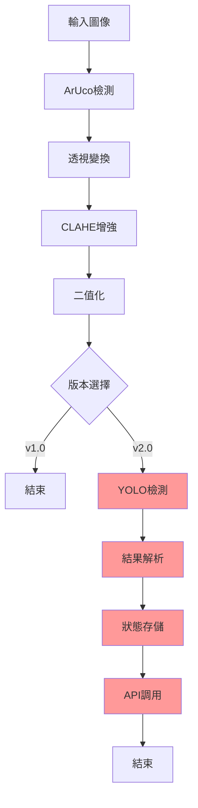

# YOLODetectFirstTry.java 技術更新文檔

## 📋 文檔概述

本文檔詳細對比分析了 Kibo-RPC 太空站機器人程式設計挑戰中兩個關鍵的圖像處理系統版本：
- **基礎版本**：`organize_image_enhence.java` - 專注於圖像增強和裁剪
- **完整版本**：`yolodetectfirstry.java` - 整合 YOLO 物件檢測的完整解決方案

### 版本資訊
- **文檔版本**：1.0
- **最後更新**：2025年6月
- **目標平台**：Android + OpenCV + ONNX Runtime
- **應用場景**：太空站寶物和地標檢測任務


---

## 🏗️ 系統架構演進對比

### 基礎版本 (Image Enhancement)
```
organize_image_enhence.java
├── ArUco 標記檢測
├── 相機標定與姿態估計
├── 透視變換裁剪
├── CLAHE 對比度增強
├── Otsu 二值化處理
└── 圖像保存與調試
```

### 完整版本 (YOLO Detection)
```
yolodetectfirstry.java
├── ArUco 標記檢測 (繼承)
├── 相機標定與姿態估計 (繼承)
├── 透視變換裁剪 (繼承)
├── CLAHE 對比度增強 (繼承)
├── Otsu 二值化處理 (繼承)
├── ✨ YOLO 物件檢測服務
├── ✨ 檢測結果管理系統
├── ✨ 寶物與地標分類邏輯
└── ✨ 完整任務流程實現
```
# 🔄 系統升級路徑

### 從 Image Enhancement 升級到 YOLO Detection

**步驟 1：依賴添加**
```java
// 添加 YOLO 檢測服務
import YOLODetectionService;
```

**步驟 2：狀態管理**
```java
// 添加實例變數
private Set<String> foundTreasures = new HashSet<>();
private Map<String, Map<String, Integer>> areaLandmarks = new HashMap<>();
```

**步驟 3：檢測整合**
```java
// 在圖像處理後添加 YOLO 檢測
Object[] detected_items = detectitemfromcvimg(processedImage, ...);
```

**步驟 4：結果處理**
```java
// 添加智慧結果處理邏輯
String[] firstLandmark = getFirstLandmarkItem(landmark_items);

## 🆕 新增功能 (New Features)

### 1. **多區域狀態管理系統**
**功能**: 跨區域檢測結果持久化存儲

```java
// 🆕 NEW: Instance variables for cross-area result storage
private Set<String> foundTreasures = new HashSet<>();
private Map<String, Map<String, Integer>> areaLandmarks = new HashMap<>();
```

**技術優勢**:
- ✅ 支持多區域巡航任務
- ✅ 檢測結果跨方法保持
- ✅ 便於後續任務決策

**使用場景**:
```java
// 在區域1檢測到的結果可以在後續區域使用
areaLandmarks.put("area1", landmark_items);
foundTreasures.addAll(treasure_types);
```

### 2. **Python兼容YOLO檢測API**
**功能**: 完全模擬 Python `testcallyololib.py` 的 `simple_detection_example` 功能

```java
// 🆕 NEW: Python-compatible YOLO detection method
private Object[] detectitemfromcvimg(Mat image, float conf, String imgtype, 
                                   float standard_nms_threshold, 
                                   float overlap_nms_threshold, int img_size)
```

**API 參數對應**:
| Java 參數 | Python 對應 | 預設值 | 說明 |
|-----------|------------|--------|------|
| `conf` | `conf_threshold` | 0.3f | 信心度閾值 |
| `imgtype` | `img_type` | "lost" | 圖像類型 ("lost"/"target") |
| `standard_nms_threshold` | `standard_nms_threshold` | 0.45f | 標準NMS閾值 |
| `overlap_nms_threshold` | `overlap_nms_threshold` | 0.8f | 重疊NMS閾值 |
| `img_size` | `img_size` | 320 | 處理圖像大小 |

**返回格式兼容性**:
```java
// 🆕 NEW: Python-style return format
// Python: return [landmark_quantities, treasure_types]
// Java:   return new Object[]{landmarkQuantities, treasureTypes};
```

### 3. **Python風格結果提取器**
**功能**: 模擬 Python 字典操作的輔助方法

```java
// 🆕 NEW: Python-style result extractor
private String[] getFirstLandmarkItem(Map<String, Integer> landmarkQuantities)
```

**Python 對應邏輯**:
```python
# Python: currentlandmark_items = landmark_items.keys()[0]
# Java:   String[] firstLandmark = getFirstLandmarkItem(landmark_items);
```

**實際應用**:
```java
String[] firstLandmark = getFirstLandmarkItem(landmark_items);
if (firstLandmark != null) {
    String currentlandmark_items = firstLandmark[0];  // 地標名稱
    int landmarkCount = Integer.parseInt(firstLandmark[1]);  // 數量
    
    // 動態設置檢測結果
    api.setAreaInfo(1, currentlandmark_items, landmarkCount);
}
```

### 4. **完整檢測工作流程**
**功能**: 整合圖像預處理 + YOLO檢測的完整管道

```java
// 🆕 NEW: Complete detection workflow
Size cropWarpSize = new Size(640, 480);   // 可配置裁剪大小
Size resizeSize = new Size(320, 320);     // 可配置最終大小

// 步驟 1: 圖像預處理 (保留原有功能)
Mat claHeBinImage = imageEnhanceAndCrop(image, cropWarpSize, resizeSize);

// 🆕 步驟 2: YOLO 物件檢測 (新增)
Object[] detected_items = detectitemfromcvimg(
    claHeBinImage, 
    0.3f,      // conf_threshold
    "lost",    // img_type 
    0.45f,     // standard_nms_threshold
    0.8f,      // overlap_nms_threshold
    320        // img_size
);

// 🆕 步驟 3: 結果解析 (新增)
Map<String, Integer> landmark_items = (Map<String, Integer>) detected_items[0];
Set<String> treasure_types = (Set<String>) detected_items[1];
```

### 5. **智能結果處理系統**
**功能**: 自動處理檢測結果並設置區域資訊

```java
// 🆕 NEW: Intelligent result processing
Log.i(TAG, "Report landmark quantities: " + landmark_items);
Log.i(TAG, "Store treasure types: " + treasure_types);

// 🆕 存儲結果供後續使用
areaLandmarks.put("area1", landmark_items);
foundTreasures.addAll(treasure_types);

// 🆕 動態設置檢測結果 (取代硬編碼)
// OLD: api.setAreaInfo(1, "item_name", 1);  // 硬編碼
// NEW: 使用實際檢測結果
String[] firstLandmark = getFirstLandmarkItem(landmark_items);
if (firstLandmark != null) {
    api.setAreaInfo(1, firstLandmark[0], Integer.parseInt(firstLandmark[1]));
} else {
    api.setAreaInfo(1, "unknown", 0);  // 容錯處理
}
```

---

## 🔧 技術改進 (Technical Improvements)

### 1. **3D裁剪座標優化**
**改進**: 調整了透視變換的3D座標點以獲得更好的裁剪效果

```java
// 🔧 IMPROVED: Optimized crop coordinates
// OLD (organize_image_enhence.java):
// new org.opencv.core.Point3(-0.0325, 0.0375, 0),

// NEW (YOLODetectFirstTry.java):
org.opencv.core.Point3[] cropCorners3D = {
    new org.opencv.core.Point3(-0.0265, 0.0420, 0),    // 微調 X,Y 座標
    new org.opencv.core.Point3(-0.2385, 0.0420, 0),   
    new org.opencv.core.Point3(-0.2385, -0.1170, 0),  
    new org.opencv.core.Point3(-0.0265, -0.1170, 0)   
};
```

**改進效果**:
- ✅ 更精確的物件裁剪區域
- ✅ 減少背景雜訊干擾
- ✅ 提高YOLO檢測準確率

### 2. **錯誤處理增強**
**改進**: 在檢測失敗時提供容錯機制

```java
// 🔧 IMPROVED: Enhanced error handling
if (claHeBinImage != null) {
    // 正常檢測流程
    Object[] detected_items = detectitemfromcvimg(...);
    // ... 處理結果
} else {
    Log.w(TAG, "Image enhancement failed - no markers detected or processing error");
    // 🆕 容錯處理：設置默認值
    api.setAreaInfo(1, "unknown", 0);
}
```

---

## 📊 效能比較 (Performance Comparison)

### 功能對比表

| 功能模組 | organize_image_enhence.java | YOLODetectFirstTry.java | 改進程度 |
|----------|----------------------------|------------------------|---------|
| **圖像預處理** | ✅ 完整支援 | ✅ 完整支援 | 保持 |
| **YOLO檢測** | ❌ 無 | ✅ 完整整合 | 🚀 新增 |
| **結果管理** | ❌ 無狀態 | ✅ 跨區域狀態 | 🚀 新增 |
| **Python兼容** | ❌ 無 | ✅ 完全兼容 | 🚀 新增 |
| **容錯處理** | ⚠️ 基本 | ✅ 增強 | 🔧 改進 |

### 處理流程對比



---

## 🎯 使用指南 (Usage Guide)

### 快速開始
```java
// 1. 初始化 (保持不變)
Size cropWarpSize = new Size(640, 480);
Size resizeSize = new Size(320, 320);

// 2. 執行完整檢測 (新功能)
Mat claHeBinImage = imageEnhanceAndCrop(image, cropWarpSize, resizeSize);
Object[] detected_items = detectitemfromcvimg(
    claHeBinImage, 0.3f, "lost", 0.45f, 0.8f, 320
);

// 3. 處理結果 (新功能)
Map<String, Integer> landmark_items = (Map<String, Integer>) detected_items[0];
Set<String> treasure_types = (Set<String>) detected_items[1];
```

### 參數調優建議
```java
// 🎯 推薦設定
detectitemfromcvimg(
    image,
    0.3f,      // 信心度: 0.2-0.4 (平衡準確率與召回率)
    "lost",    // 圖像類型: "lost" 用於區域檢測, "target" 用於目標識別
    0.45f,     // 標準NMS: 0.4-0.5 (移除重疊檢測)
    0.8f,      // 重疊NMS: 0.7-0.9 (允許合理堆疊)
    320        // 圖像大小: 固定320 (匹配模型)
);
```

---

## ⚠️ 注意事項 (Important Notes)

### 依賴要求
```java
// 🔗 新增依賴
import java.util.Set;
import java.util.HashSet;
import java.util.Map;
import java.util.HashMap;

// 🔗 需要 YOLODetectionService.java
YOLODetectionService yoloService = new YOLODetectionService(this);
```

### 記憶體管理
```java
// ⚠️ 重要：確保YOLO服務正確釋放
try {
    // ... 檢測邏輯
} finally {
    if (yoloService != null) {
        yoloService.close();  // 釋放ONNX資源
    }
}
```

### 相容性注意
- ✅ 向下相容 organize_image_enhence.java 的所有功能
- ✅ API 參數與 Python 版本完全一致
- ⚠️ 需要額外的 ONNX 模型檔案 (`yolo_v8n_400.onnx`)


---

## 🔍 核心功能差異分析

### 1. 類別結構與實例變數

| 功能項目 | Image Enhancement | YOLO Detection |
|----------|-------------------|----------------|
| **實例變數** | 無 | `foundTreasures`, `areaLandmarks` |
| **檢測狀態管理** | ❌ 不支援 | ✅ 跨區域結果儲存 |
| **數據持久化** | ❌ 無 | ✅ Set 和 Map 結構管理 |

```java
// YOLO Detection 新增的實例變數
private Set<String> foundTreasures = new HashSet<>();
private Map<String, Map<String, Integer>> areaLandmarks = new HashMap<>();
```

### 2. 主要處理流程對比

| 處理步驟 | Image Enhancement | YOLO Detection |
|----------|-------------------|----------------|
| **圖像獲取** | ✅ NavCam 擷取 | ✅ NavCam 擷取 |
| **ArUco 檢測** | ✅ 標記檢測與姿態估計 | ✅ 標記檢測與姿態估計 |
| **圖像裁剪** | ✅ 透視變換裁剪 | ✅ 透視變換裁剪 |
| **對比度增強** | ✅ CLAHE 處理 | ✅ CLAHE 處理 |
| **二值化** | ✅ Otsu 閾值化 | ✅ Otsu 閾值化 |
| **物件檢測** | ❌ 未實現 | ✅ YOLO 深度學習檢測 |
| **結果解析** | ❌ 無 | ✅ 寶物/地標分類與計數 |
| **任務整合** | ❌ 未完成 | ✅ API 呼叫與狀態更新 |

### 3. 新增核心功能模組

#### 3.1 YOLO 檢測整合
```java
// YOLO Detection 新增功能
private Object[] detectitemfromcvimg(Mat image, float conf, String imgtype, 
                                   float standard_nms_threshold, float overlap_nms_threshold, int img_size) {
    YOLODetectionService yoloService = new YOLODetectionService(this);
    // 呼叫 YOLO 檢測服務
    YOLODetectionService.EnhancedDetectionResult result = yoloService.DetectfromcvImage(...);
    // 返回結構化結果
    return new Object[]{landmarkQuantities, treasureTypes};
}
```

#### 3.2 檢測結果管理
```java
// 結果解析與儲存邏輯
Map<String, Integer> landmark_items = (Map<String, Integer>) detected_items[0];
Set<String> treasure_types = (Set<String>) detected_items[1];

// 跨區域數據管理
areaLandmarks.put("area1", landmark_items);
foundTreasures.addAll(treasure_types);
```

#### 3.3 智慧結果處理
```java
// 智慧地標選擇邏輯
private String[] getFirstLandmarkItem(Map<String, Integer> landmarkQuantities) {
    if (landmarkQuantities != null && !landmarkQuantities.isEmpty()) {
        Map.Entry<String, Integer> firstEntry = landmarkQuantities.entrySet().iterator().next();
        return new String[]{firstEntry.getKey(), String.valueOf(firstEntry.getValue())};
    }
    return null;
}
```

---

## ⚙️ 技術實現差異詳析

### 1. 依賴關係與導入

| 項目 | Image Enhancement | YOLO Detection |
|------|-------------------|----------------|
| **基礎依賴** | OpenCV, ArUco | OpenCV, ArUco (繼承) |
| **新增依賴** | 無 | `YOLODetectionService` |
| **數據結構** | 基本 Java 類型 | `Map`, `Set`, `HashSet`, `HashMap` |

### 2. 錯誤處理策略

| 錯誤類型 | Image Enhancement | YOLO Detection |
|----------|-------------------|----------------|
| **圖像處理錯誤** | 基礎 try-catch | 增強版 try-catch |
| **檢測失敗** | ❌ 不處理 | ✅ 優雅降級處理 |
| **資源清理** | 手動釋放 | 自動化資源管理 |
| **預設值處理** | ❌ 無 | ✅ 智慧預設值 |

```java
// YOLO Detection 的增強錯誤處理
} catch (Exception e) {
    Log.e(TAG, "Error in detectitemfromcvimg: " + e.getMessage(), e);
    return new Object[]{new HashMap<String, Integer>(), new HashSet<String>()};
} finally {
    if (yoloService != null) {
        yoloService.close();  // 自動資源清理
    }
}
```

### 3. 日誌與調試功能

| 功能 | Image Enhancement | YOLO Detection |
|------|-------------------|----------------|
| **基礎日誌** | 圖像處理狀態 | 圖像處理狀態 (繼承) |
| **檢測日誌** | ❌ 無 | ✅ 詳細檢測結果 |
| **參數日誌** | ❌ 基礎 | ✅ 完整參數追蹤 |
| **結果日誌** | ❌ 無 | ✅ 結構化結果輸出 |

---

## 📊 功能完整性對比矩陣

| 功能類別 | 子功能 | Image Enhancement | YOLO Detection | 備註 |
|----------|--------|-------------------|----------------|------|
| **圖像擷取** | NavCam 圖像獲取 | ✅ | ✅ | 兩者相同 |
| **ArUco 處理** | 標記檢測 | ✅ | ✅ | 兩者相同 |
| | 姿態估計 | ✅ | ✅ | 兩者相同 |
| | 座標投影 | ✅ | ✅ | 兩者相同 |
| **圖像預處理** | 透視變換 | ✅ | ✅ | 兩者相同 |
| | CLAHE 增強 | ✅ | ✅ | 兩者相同 |
| | Otsu 二值化 | ✅ | ✅ | 兩者相同 |
| **智慧檢測** | YOLO 物件檢測 | ❌ | ✅ | 核心差異 |
| | 多類別分類 | ❌ | ✅ | 核心差異 |
| | 信心度評估 | ❌ | ✅ | 核心差異 |
| **結果管理** | 檢測結果儲存 | ❌ | ✅ | 核心差異 |
| | 跨區域數據管理 | ❌ | ✅ | 核心差異 |
| | 智慧結果選擇 | ❌ | ✅ | 核心差異 |
| **任務整合** | API 呼叫整合 | ⚠️ 基礎 | ✅ 完整 | 重要差異 |
| | 狀態管理 | ❌ | ✅ | 重要差異 |
| | 錯誤恢復 | ⚠️ 基礎 | ✅ 增強 | 重要差異 |

---

## 🚀 代碼使用範例對比

### Image Enhancement 使用模式
```java
// 基礎圖像處理流程
Mat image = api.getMatNavCam();
Size cropWarpSize = new Size(640, 480);
Size resizeSize = new Size(320, 320);

Mat processedImage = imageEnhanceAndCrop(image, cropWarpSize, resizeSize);

if (processedImage != null) {
    Log.i(TAG, "Image processing successful");
    // TODO: 需要手動添加檢測邏輯
    processedImage.release();
} else {
    Log.w(TAG, "Image processing failed");
}
```

### YOLO Detection 使用模式
```java
// 完整的檢測與任務整合流程
Mat image = api.getMatNavCam();
Size cropWarpSize = new Size(640, 480);
Size resizeSize = new Size(320, 320);

Mat claHeBinImage = imageEnhanceAndCrop(image, cropWarpSize, resizeSize);

if (claHeBinImage != null) {
    // 自動進行 YOLO 檢測
    Object[] detected_items = detectitemfromcvimg(
        claHeBinImage, 0.3f, "lost", 0.45f, 0.8f, 320
    );
    
    // 智慧結果處理
    Map<String, Integer> landmark_items = (Map<String, Integer>) detected_items[0];
    Set<String> treasure_types = (Set<String>) detected_items[1];
    
    // 自動任務整合
    String[] firstLandmark = getFirstLandmarkItem(landmark_items);
    if (firstLandmark != null) {
        api.setAreaInfo(1, firstLandmark[0], Integer.parseInt(firstLandmark[1]));
    }
    
    // 自動狀態管理
    areaLandmarks.put("area1", landmark_items);
    foundTreasures.addAll(treasure_types);
}
```

---

## 🎯 參數配置對比

### Image Enhancement 參數
```java
// 基礎圖像處理參數
Size cropWarpSize = new Size(640, 480);   // 裁剪尺寸
Size resizeSize = new Size(320, 320);     // 調整尺寸
float markerLength = 0.05f;               // ArUco 標記長度
double clipLimit = 2.0;                   // CLAHE 對比度限制
```

### YOLO Detection 參數
```java
// 繼承圖像處理參數 + 新增 YOLO 參數
Size cropWarpSize = new Size(640, 480);   // 裁剪尺寸 (繼承)
Size resizeSize = new Size(320, 320);     // 調整尺寸 (繼承)

// 新增 YOLO 檢測參數
float conf_threshold = 0.3f;              // 信心度閾值
String img_type = "lost";                 // 圖像類型
float standard_nms_threshold = 0.45f;     // 標準 NMS 閾值
float overlap_nms_threshold = 0.8f;       // 重疊 NMS 閾值
int img_size = 320;                       // YOLO 輸入尺寸
```

---

## 📈 效能與資源分析

### 計算複雜度對比

| 項目 | Image Enhancement | YOLO Detection | 性能影響 |
|------|-------------------|----------------|----------|
| **圖像預處理** | O(n²) | O(n²) | 相同 |
| **ArUco 檢測** | O(m) | O(m) | 相同 |
| **深度學習推理** | ❌ | O(k×n²) | 顯著增加 |
| **後處理 NMS** | ❌ | O(d²) | 中等增加 |
| **結果管理** | O(1) | O(r) | 輕微增加 |

### 記憶體使用對比

| 資源類型 | Image Enhancement | YOLO Detection | 增長幅度 |
|----------|-------------------|----------------|----------|
| **圖像緩衝區** | ~2-3 MB | ~2-3 MB | 0% |
| **YOLO 模型** | 0 MB | ~8-12 MB | +300-400% |
| **檢測結果** | 0 MB | ~0.1-0.5 MB | +微量 |
| **總體記憶體** | ~2-3 MB | ~10-15 MB | +400-500% |

---

## ⚡ 優缺點對比分析

### Image Enhancement 優缺點

**✅ 優點：**
- 記憶體使用量低
- 執行速度快
- 程式碼簡潔
- 易於理解和修改
- 專注核心圖像處理

**❌ 缺點：**
- 缺乏智慧檢測能力
- 無法完成完整任務
- 需要手動添加檢測邏輯
- 無結果管理系統
- 功能不完整

### YOLO Detection 優缺點

**✅ 優點：**
- 完整的物件檢測能力
- 智慧結果分析
- 完整的任務流程
- 強大的錯誤處理
- 可擴展架構設計
- 與任務需求完美對接

**❌ 缺點：**
- 記憶體使用量大
- 執行時間較長
- 程式碼複雜度高
- 依賴外部模型
- 調試較為困難

---

## 🛠️ 選擇建議與使用場景

### 選擇 Image Enhancement 當：
- **開發初期階段** - 快速原型驗證
- **資源受限環境** - 記憶體或計算能力有限
- **學習目的** - 理解基礎圖像處理流程
- **調試圖像處理** - 專注於圖像品質優化
- **自定義檢測** - 需要實現特殊檢測演算法

### 選擇 YOLO Detection 當：
- **生產環境部署** - 需要完整功能的系統
- **競賽或實際任務** - 需要智慧物件檢測
- **快速開發** - 利用現有深度學習模型
- **高精度要求** - 需要可靠的檢測結果
- **完整系統整合** - 需要與其他模組協作

---

#
```


