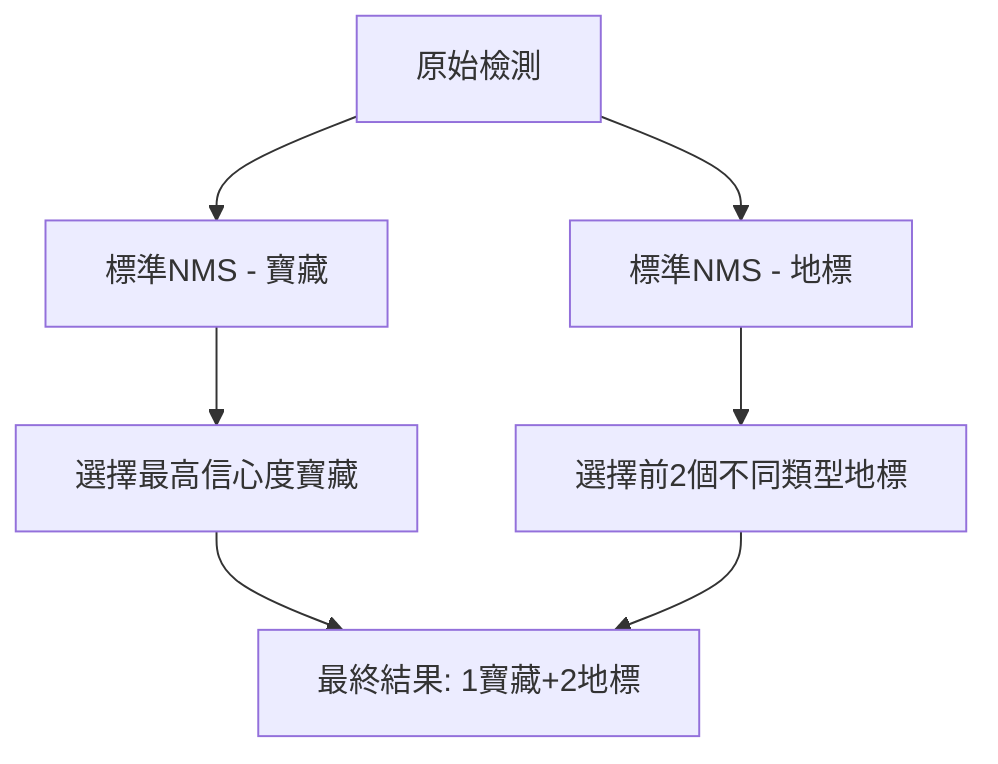
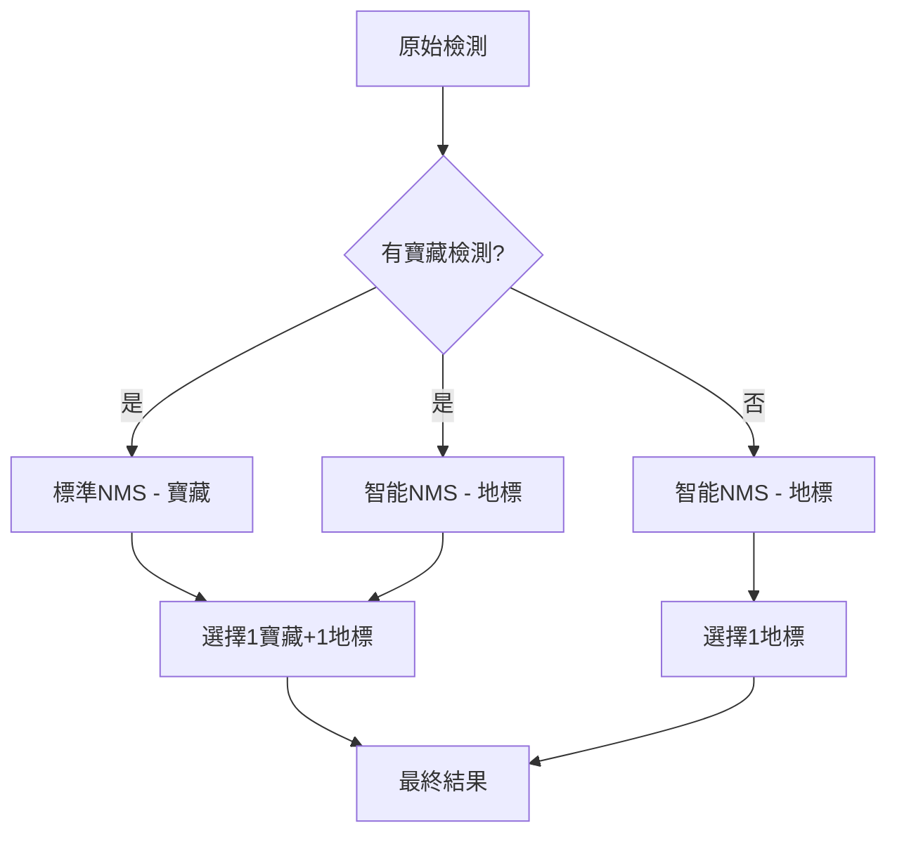

# YOLO 後處理邏輯與檢測腳本完整指南

本指南詳細解釋 YOLOv8 後處理邏輯和檢測腳本的工作原理，幫助您理解整個檢測流程。

## 目錄
1. [整體架構概覽](#整體架構概覽)
2. [yolo_detect_images.py 腳本用途](#yolo_detect_images腳本用途)
3. [yoloraw_postprocessing.py 邏輯詳解](#yoloraw_postprocessing邏輯詳解)
4. [關鍵參數說明](#關鍵參數說明)
5. [檢測邏輯流程](#檢測邏輯流程)
6. [使用範例與調優建議](#使用範例與調優建議)

---

## 整體架構概覽

### 系統組成
```
┌─────────────────────────┐
│   yolo_detect_images.py │  ← 主執行腳本
│   (主要入口點)          │
└─────────────┬───────────┘
              │ 呼叫
              ▼
┌─────────────────────────┐
│ yoloraw_postprocessing.py│  ← 後處理核心邏輯
│   (複雜後處理邏輯)       │
└─────────────────────────┘
```

### 專案特色
這是一個**寶藏與地標檢測系統**，專門設計用於檢測兩類物件：
- **寶藏類別**：crystal（水晶）、diamond（鑽石）、emerald（綠寶石）
- **地標類別**：coin（硬幣）、compass（指南針）、coral（珊瑚）、fossil（化石）、key（鑰匙）、letter（信件）、shell（貝殼）、treasure_box（寶箱）

---

## yolo_detect_images.py 腳本用途

### 🎯 主要功能
這是整個檢測系統的**主入口點**，負責：
1. **設定檢測參數**
2. **載入圖片和模型**
3. **執行檢測流程**
4. **輸出結果統計**

### 📝 腳本結構解析

```python
# 1. 檔案路徑設定
model_path = r'path/to/best.pt'           # 訓練好的模型權重
image_base_folder = r'path/to/images'     # 圖片資料夾
image_names = ['image1.png', 'image2.png'] # 要檢測的圖片清單

# 2. 檢測參數設定
img_type = "lost"                         # 檢測類型："lost" 或 "target"
img_size = 320                           # 圖片尺寸（必須與訓練時一致）
conf_threshold = 0.3                     # 信心度閾值
standard_nms_threshold = 0.45            # 標準 NMS 閾值
overlap_nms_threshold = 0.8              # 重疊 NMS 閾值

# 3. 執行檢測
detections = simple_detection_example(...)

# 4. 結果處理
report_landmark = []    # 地標數量統計
store_treasure = []     # 寶藏類型統計
```

### 🔧 關鍵變數說明

| 變數 | 功能 | 重要性 |
|------|------|--------|
| `img_type` | 決定檢測邏輯模式 | ⭐⭐⭐ |
| `img_size` | 必須與訓練時一致 | ⭐⭐⭐ |
| `conf_threshold` | 過濾低信心度檢測 | ⭐⭐ |
| `standard_nms_threshold` | 移除重疊的不同類別物件 | ⭐⭐ |
| `overlap_nms_threshold` | 允許同類別物件堆疊 | ⭐⭐ |

---

## yoloraw_postprocessing.py 邏輯詳解

### 🏗️ 模組架構

```
yoloraw_postprocessing.py
├── convert_detections_to_final_format()     # 格式轉換
├── apply_standard_nms()                     # 標準 NMS
├── apply_landmark_intelligent_nms()         # 智能 NMS  
├── yolo_postprocess_pipeline()              # 主處理流程
├── load_image_path()                        # 圖片載入
├── get_raw_yolo_tensor_flexible()           # 獲取原始輸出
├── deal_with_result_detections()            # 結果處理
└── simple_detection_example()               # 簡化接口
```

### 📊 資料流程圖

```
原始圖片 → YOLO模型 → 原始張量 → 後處理管道 → 最終結果
   ↓          ↓          ↓           ↓          ↓
[H,W,C]   [1,15,2100] [1,2100,15]  智能NMS   檢測清單
```

### 🧠 核心函數詳解

#### 1. `yolo_postprocess_pipeline()` - 主處理流程

這是最重要的函數，處理整個後處理邏輯：

```python
def yolo_postprocess_pipeline(raw_tensor, conf_threshold, nms_thresholds, img_size, imgtype):
    # Step 1: 張量格式轉換
    # Step 2: 應用信心度閾值
    # Step 3: 分離寶藏與地標檢測
    # Step 4: 根據圖片類型應用不同邏輯
    # Step 5: 智能 NMS 處理
    # Step 6: 最終結果選擇
```

**處理步驟詳解：**

1. **張量格式轉換**
   - 輸入：`[1, 15, 2100]` → 輸出：`[1, 2100, 15]`
   - 15 = 4（邊界框座標）+ 11（類別分數）
   - 2100 = 10×10 + 20×20 + 40×40（不同尺度的錨點總數）

2. **信心度過濾**
   - 只保留信心度 > `conf_threshold` 的檢測
   - 每個檢測可能對應多個類別

3. **類別分離**
   - **寶藏檢測**：crystal、diamond、emerald
   - **地標檢測**：coin、compass、coral、fossil、key、letter、shell、treasure_box

#### 2. `apply_standard_nms()` - 標準非極大值抑制

```python
def apply_standard_nms(detections, nms_threshold):
    # 用於移除重疊的不同類別物件
    # 適用於寶藏檢測（不同寶藏不應重疊）
```

**使用時機：**
- 寶藏檢測（不同寶藏類型不應該在同一位置）
- Target 模式的地標檢測

#### 3. `apply_landmark_intelligent_nms()` - 智能非極大值抑制

```python
def apply_landmark_intelligent_nms(detections, overlap_nms_threshold):
    # 智能處理地標堆疊情況
    # 1. 選擇信心度最高的類別
    # 2. 只保留該類別的檢測
    # 3. 允許同類別物件適度重疊
```

**智能邏輯：**
1. 找出信心度最高的檢測及其類別
2. 過濾出同類別的所有檢測
3. 對同類別檢測應用較寬鬆的 NMS（允許堆疊）

---

## 關鍵參數說明

### 📊 信心度閾值 (conf_threshold)

| 數值 | 效果 | 適用場景 |
|------|------|----------|
| 0.1-0.2 | 檢測敏感，可能有誤檢 | 不遺漏任何可能目標 |
| 0.3-0.5 | 平衡檢測與準確性 | **推薦設定** |
| 0.6-0.9 | 高準確性，可能遺漏 | 只要高信心度檢測 |

### 🔧 NMS 閾值設定

#### standard_nms_threshold (0.45)
- **用途**：移除不同類別間的重疊
- **原理**：IoU > 閾值的檢測會被移除
- **建議**：0.3-0.6

#### overlap_nms_threshold (0.8)
- **用途**：允許同類別物件堆疊
- **原理**：較高閾值允許更多重疊
- **建議**：0.6-0.9

---

## 檢測邏輯流程

### 🎯 Target 模式 (img_type="target")

**目標**：檢測 1 個寶藏 + 2 個不同類型的地標



**邏輯特點：**
- 寶藏和地標都使用標準 NMS
- 嚴格選擇：1 寶藏 + 2 不同地標類型
- 適用於尋找特定目標的場景

### 🔍 Lost 模式 (img_type="lost")

**目標**：檢測 1 個地標 OR 1 個地標 + 1 個寶藏



**邏輯特點：**
- 寶藏使用標準 NMS
- 地標使用智能 NMS（允許堆疊）
- 彈性選擇：可以只有地標，也可以有寶藏+地標
- 適用於尋找遺失物品的場景

### 🧠 智能 NMS 的獨特之處

**傳統 NMS 問題：**
- 會移除所有重疊的檢測，包括同類別的堆疊物件
- 可能導致遺漏真實的物件堆疊情況

**智能 NMS 解決方案：**
1. **類別統一**：只保留信心度最高類別的檢測
2. **允許堆疊**：使用較高的 IoU 閾值
3. **數量保留**：保留合理數量的同類別檢測

---

## 使用範例與調優建議

### 🚀 基本使用範例

```python
# 1. 設定檔案路徑
model_path = r'path/to/best.pt'
image_base_folder = r'path/to/images'
image_names = ['test_image.png']

# 2. 設定檢測參數
img_type = "lost"              # 選擇檢測模式
img_size = 320                 # 圖片尺寸
conf_threshold = 0.3           # 信心度閾值
standard_nms_threshold = 0.45  # 標準NMS
overlap_nms_threshold = 0.8    # 重疊NMS

# 3. 載入圖片
cv_img_list = []
for image_name in image_names:
    image_path = os.path.join(image_base_folder, image_name)
    cv_img = load_image_path(image_path, img_size=img_size)
    cv_img_list.append(cv_img)

# 4. 執行檢測
detections = simple_detection_example(
    model_path=model_path,
    cv_img_list=cv_img_list,
    img_type=img_type,
    img_size=img_size,
    conf_threshold=conf_threshold,
    standard_nms_threshold=standard_nms_threshold,
    overlap_nms_threshold=overlap_nms_threshold
)

# 5. 查看結果
print(f"檢測結果: {detections}")
```

### 🔧 參數調優建議

#### 檢測效果不佳時

**問題：檢測不到物件**
```python
# 解決方案：降低信心度閾值
conf_threshold = 0.1  # 從 0.3 降到 0.1
```

**問題：太多誤檢**
```python
# 解決方案：提高信心度閾值
conf_threshold = 0.5  # 從 0.3 提高到 0.5
```

**問題：重疊物件被過度移除**
```python
# 解決方案：調整 NMS 閾值
standard_nms_threshold = 0.3     # 降低標準NMS
overlap_nms_threshold = 0.9      # 提高重疊NMS
```

**問題：堆疊物件檢測不準**
```python
# 解決方案：使用 lost 模式並調整參數
img_type = "lost"
overlap_nms_threshold = 0.7      # 適度降低重疊閾值
```

### 📈 不同場景的推薦設定

#### 場景1：精確目標檢測
```python
img_type = "target"
conf_threshold = 0.5
standard_nms_threshold = 0.4
overlap_nms_threshold = 0.7
```

#### 場景2：遺失物品搜索
```python
img_type = "lost"
conf_threshold = 0.2
standard_nms_threshold = 0.5
overlap_nms_threshold = 0.8
```

#### 場景3：高密度物件檢測
```python
img_type = "lost"
conf_threshold = 0.3
standard_nms_threshold = 0.6
overlap_nms_threshold = 0.9
```

### ⚠️ 常見錯誤與解決

1. **圖片尺寸不匹配**
   ```python
   # 錯誤：使用與訓練時不同的尺寸
   img_size = 640  # 訓練時使用320
   
   # 正確：使用與訓練時相同的尺寸
   img_size = 320  # 與訓練時一致
   ```

2. **路徑設定錯誤**
   ```python
   # 檢查檔案是否存在
   import os
   assert os.path.exists(model_path), f"模型檔案不存在: {model_path}"
   assert os.path.exists(image_path), f"圖片檔案不存在: {image_path}"
   ```

3. **記憶體不足**
   ```python
   # 減少批次處理圖片數量
   image_names = ['single_image.png']  # 一次處理一張圖片
   ```

---
